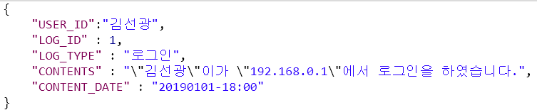
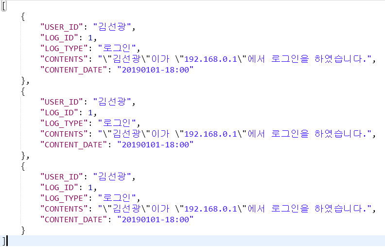
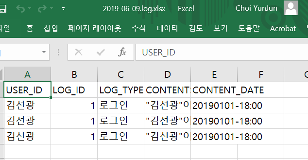

# node-express-generator-template

../test 페이지 접속 후 db.js테스트 가능  

# logs.js  
### 로그 저장용 함수 logs.make_xlsx("파일이름", {JSON오브젝트}) : public/logs/오늘날짜.log.xlsx로 엑셀파일 생성(이미 존재하면 내용 추가)  
#### POST param  
  
#### RESPONSE by server  
  
#### 생성된 파일 내용  
  
#### 현재 /make_xlsx 로 POST 매핑 해놨으니 자유롭게 수정 가능  

# views template 

### 2019-05-21 페이지 포멧 제작 및 기본 라우팅 경로 merge by sean ###
