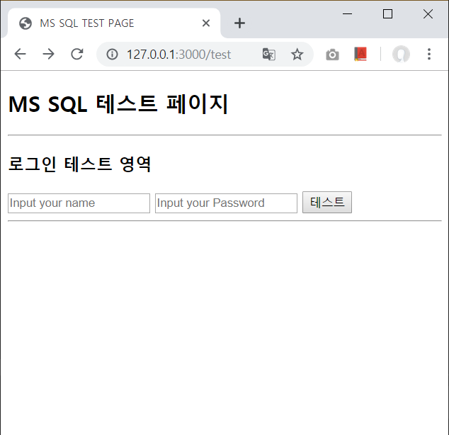

# node-express-generator-template

| 메소드 | 경로 | 짧은 설명 |
| ------ | ------ | ------ |
| POST | /user/signin | 로그인 |
### 요청 헤더
```
Content-Type: application/json
```
### 요청 바디
| 변수 이름 | 설명 | 타입 | 값 | 비고 |
| ------ | ------ | ------ | ------ | ------ |
| login_name | 아이디 | VARCHAR | NOTNULL |
| login_pw | 비밀번호 | VARCHAR | NOTNULL |
* example
```
{
    "login_name": "nsrcau",
    "login_pw": "nsrcau11!"
}
```
## Response

### 성공
```
{
    "status": 200,
    "code": 200,
    "message": "success",
    "data": null
}
```
### 실패

* 로그인 실패
```
{
    "status": 400,
    "code": 4006,
    "description": "로그인 실패",
    "message": "Login Failed"
}
```
* 빈값이 넘어온경우
```
{
    "status": 400,
    "code": 4005,
    "description": "빈칸을 모두 채우세요",
    "message": "Please fill the blank."
}
```
* 서버 에러
```
{ 
    "status": 500,
    "code": 5000,
    "description": '서버에러',
    "message": 'Internal Server Error' 
}

```
### 2019-05-12 로그인 API 추가

